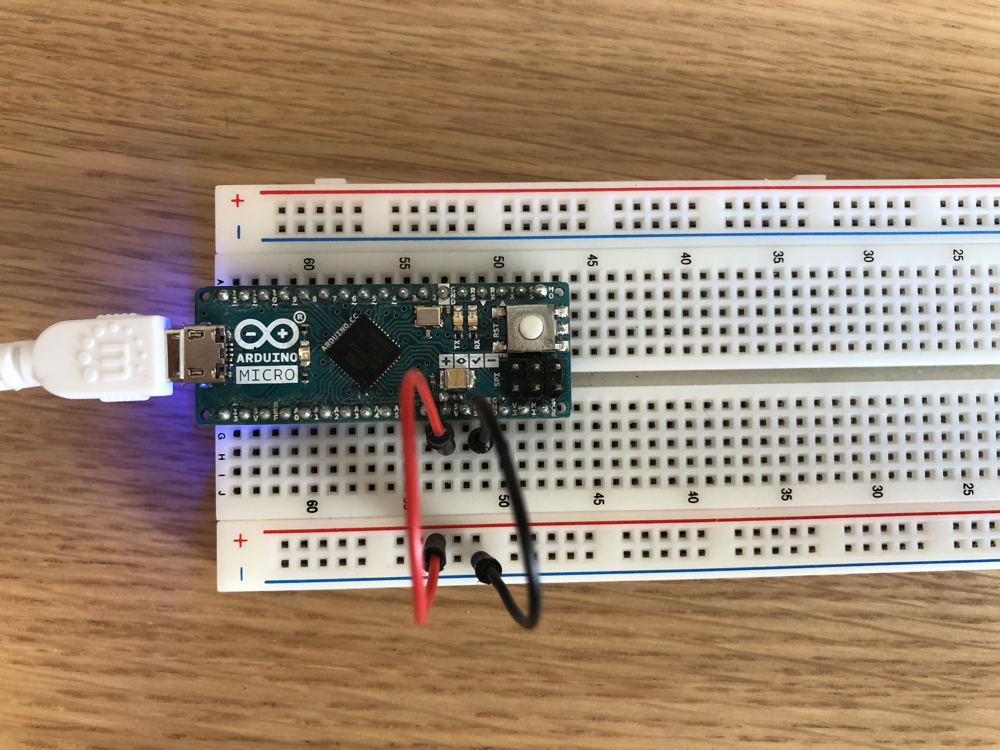
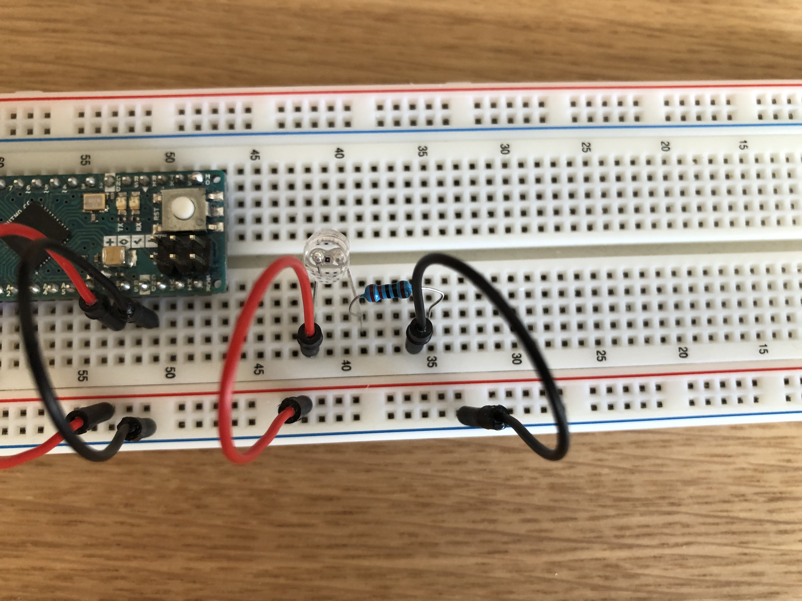
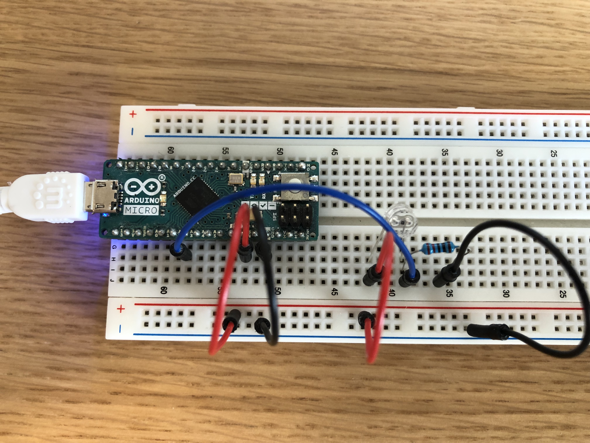
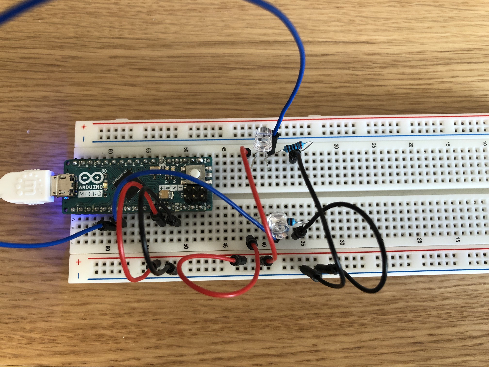
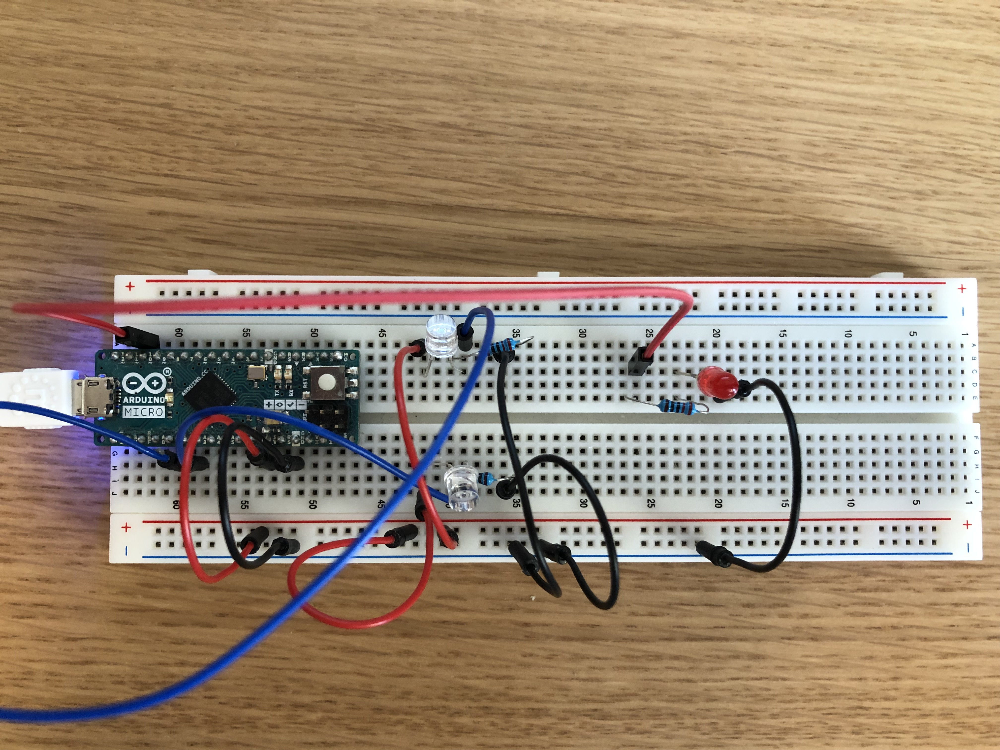

# Use LDRs to sense direction
### Introduction
An LDR, or light dependent resistor, has a dynamic resistance that changes depending on the amount of light that hits it. By connecting it to your arduino board of choice will let you measure brightness.  Connecting LDRs to your Arduino is very simple, yet their input can be used in many creative ways, and in this tutorial you will learn how you can take advantage of just two of these dynamic resistors to determine the direction from which an approaching object is coming.

### Materials
The materials you will need are as follows:
* Arduino Micro (can be substituted with another model) 
* Breadboard
* LDR (2 pc)
* LED (2 pc)
* 10kΩ Resistor (4 pc)
* wires

### LDR
Light dependent resistors are not normally used in this way, and one could argue that they are not the best suited sensor. But their size and simplicity makes them very easy to work with, and with a little bit of creativity you can nearly invisibly mount them on or in an object to add functionality to it. 
### Assembly
The most interesting part of this contraption is the input, the output could be done in many ways, but in this tutorial you will use two LEDs that indicate the direction.
 We start with the input:

#### Input
* For convenience, connect the 5V and GND pins to the outer lines of the breadboard, as such:

* Identify the direction of the LDR, and connect its long leg to +, and the short leg to - in series with a 10kΩ resistor. 

* Now connect analog pin A3 of your arduino to the LDRs short leg

* Repeat on the other side of the breadboard, but connect this LDR to A2 instead.

And that's it! Your LDRs are hooked up!
#### Output
* Identify the direction of your LED, and connect the long leg to pin 10 in series with a 10kΩ resistor, and the short leg to -. 

* Repeat on the other side of the breadboard. 

Now the circuit has been completed!
### Code

### Conclusion  