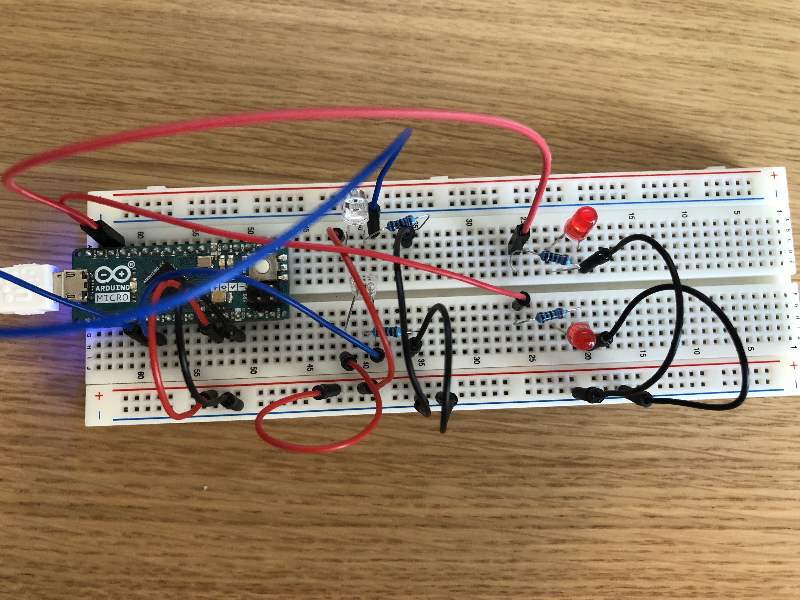
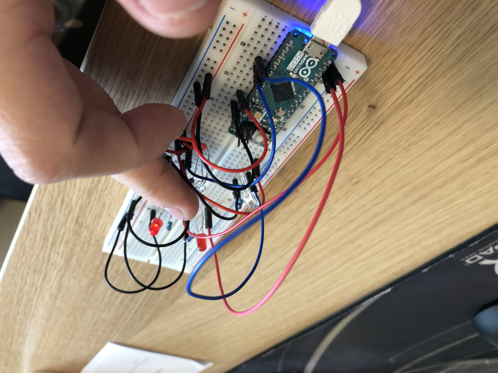

# Use LDRs to sense direction
## Introduction
An LDR, or light dependent resistor, is a dynamic resistor that changes strength depending on the amount of light that hits it. Connecting it to your arduino board of choice will let you measure brightness. Connecting LDRs is very simple, yet their input can be used in many creative ways, and in this tutorial you will learn how you can take advantage of just two of these dynamic resistors to determine the direction from which an approaching object is coming.

## Materials
The materials you will need are as follows:
* Arduino Micro (can be substituted with another model) 
* Breadboard
* LDR (2 pc)
* LED (2 pc)
* 10kΩ Resistor (4 pc)
* wires

## LDR
Light dependent resistors are not normally used in this way, and one could argue that they are not the best suited sensor for this application. But their size and simplicity makes them very easy to work with, and with a little bit of creativity you can nearly invisibly mount them on or in an object to add functionality to it. 
## Assembly
The most interesting part of this contraption is the input, the output could be done in many ways, but in this tutorial you will use two LEDs that indicate the direction.
 We start with the input:

### Input
* For convenience, connect the 5V and GND pins to the outer lines of the breadboard, as such:

* Identify the direction of the LDR, and connect its long leg to +, and the short leg to - in series with a 10kΩ resistor. 

* Now connect analog pin A3 of your arduino to the LDRs short leg

* Repeat on the other side of the breadboard, but connect this LDR to A2 instead.

And that's it! Your LDRs are hooked up!
### Output
* Identify the direction of your LED, and connect the long leg to pin 10 in series with a 10kΩ resistor, and the short leg to -. 

* Repeat on the other side of the breadboard. 

Now the circuit has been completed!
## Code
If you just want the entire code in one piece, without the step by step guide on how to build it yourself, you can find it at the bottom of this tutorial. Otherwise, keep reading.

We start by initializing our two LDR pins. Add these lines of code to the very top of your sketch. 

>int LDRPin = A3; 
  int LDRPin2 = A2; 

Now do the same with the LED pins

>int ledPin = 10;
  int ledPin2 = 11;

We will need a few variables to contain values before they are treated.

>int val = 0;
  int val2 = 0;
  int lightLevel = 0;
  int lightLevel2 = 0;

Leave void setup(){} Empty. 

The rest of the code will be kept within void loop(){}

Start by reading the value of your LDRs. We will also be remapping those values in this step to proportionally scale them to fit the minimum and maximum values of the output pins.

>val = analogRead(LDRPin);
  val = map(val, 0, 900, 0, 255);
  val2 = analogRead(LDRPin2);
  val2 = map(val2, 0, 900, 0, 255);

At this stage, you can try out your LDRs by printing the value we have just read and remapped, this step is optional, but it might be a good idea to make sure everything you have done up until this point is correct. 

>Serial.println(val);
  Serial.println(val2);

Now, upload the code you have written this far to the Arduino board. If you open the serial monitor that you find under the Tools tab in your IDE, you should now see a measurement of light from your two LDRs. Try covering one of the LDRs with your hand and see if the values react. If they don't, it would be a good idea to backtrack into the tutorial, and find where you have made a mistake. 

These values could be written to your LEDs now, and they would light up, however they would be lit independently from each other, and in this example it is more interesting if they react to one another.

Add this line next
> lightLevel = val - val2;

And to make sure that it never goes into the negative:

>if(lightLevel < 0){  
    lightLevel = 0;  
}

Repeat, but invert

>lightLevel2 = val2 - val;  
if(lightLevel2 < 0){  
    lightLevel2 = 0;  
}

And finally we write these light level values to the LED pins.

>analogWrite(ledPin, lightLevel);  
analogWrite(ledPin2, lightlevel2);

## Full code
>int LDRPin = A3;    // select the input pins for your LDRs  
int LDRPin2 = A2;   
int ledPin = 10;   // select the pins for the LEDs  
int ledPin2 = 11;  
int val = 0;       // variable to store the value coming from the sensor before treatment  
int val2 = 0;   
int lightLevel = 0; // variables to store treated values  
int lightLevel2 = 0;   
void setup() {}  
void loop() {  
  val = analogRead(LDRPin);     // read values from sensors, and remap 
  val = map(val, 0, 900, 0, 255);  
  val2 = analogRead(LDRPin2);  
  val2 = map(val2, 0, 900, 0, 255);     
  lightLevel = val - val2;      // treat the values  
  if(lightLevel < 0){ 
    lightLevel = 0; 
  }  
  lightLevel2 = val2 - val; 
  if(lightLevel2 < 0){ 
    lightLevel2 = 0; 
  }     
  analogWrite(ledPin, lightLevel);  // write values to the LED pins 
  analogWrite(ledPin2, lightLevel2);  
}

## Conclusion  
Now, if you are in an evenly lit room, when you approach your circuit from either of the LDRs, you will notice that the LEDs will react to you. Lighting up the relevant one as you get closer.

This circuit by itself does not serve any singular purpose, but now you have learnt how to connect LDRs, and a way you can creatively use LDRs for something they were not intended to. We implore you to keep experimenting with the circuit, implement it into something else, swap the output, build it into a game, give an everyday item some personality. Create something new. 